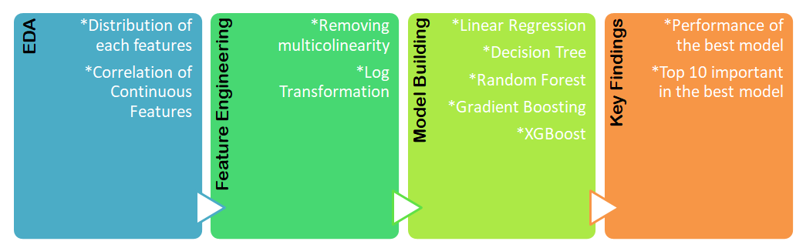

# House-Price-Prediction

## Project Goal
It is a dataset house sold between May 2014 to May 2015 in King County an area. The dataset consisted of 21 variables and 21,613 observations.

Key features

  * Description of houses
  * Location
  * Date of selling
  * Price

The primary objective of this project is to develop an accurate predictive model that estimates house prices based on location and type of house for real estate development projects in King county. This predictive model forecast the ideal selling price based on the property features, locatinon, allowing for more competitive pricing and faster sales.

## Project Workflow

